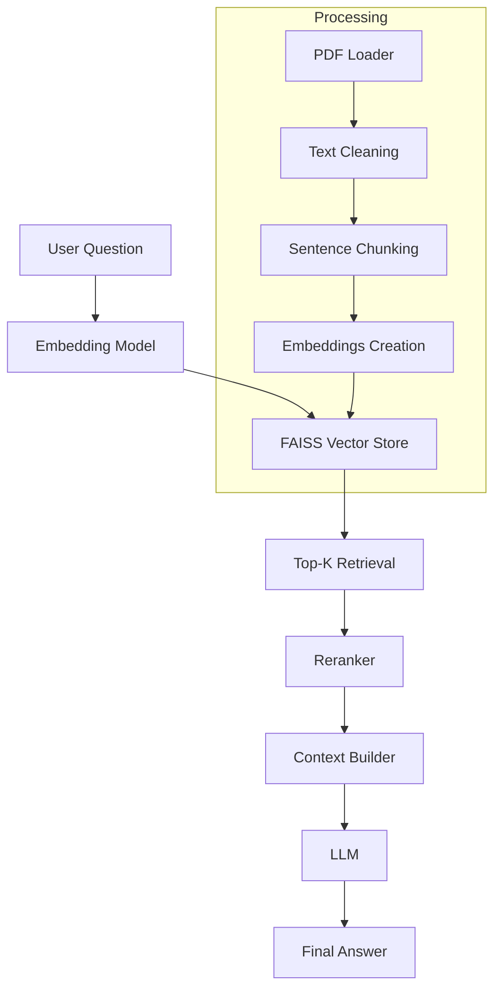

# Mini Knowledge API (RAG System)


A production-oriented Retrieval-Augmented Generation (RAG) API built with FastAPI.
This project demonstrates a complete pipeline for document ingestion, semantic search, and question answering using embeddings and vector search.

---

## Features

* Semantic search with embeddings and FAISS
* Retrieval-Augmented Generation (RAG)
* PDF document ingestion and processing
* Sentence-aware chunking with overlap
* Evaluation framework for retrieval and answer quality
* Observability and tracing across the pipeline
* FastAPI serving layer
* Reindexing pipeline via CLI

---

## Architecture



---

## Project Structure

```text
mini-knowledge-api
│
├── app/
│   ├── api/                # FastAPI routes
│   ├── core/               # RAG logic, embeddings, vector store
│   ├── processing/         # Document ingestion and chunking
│   ├── observability/      # Logging and tracing
│   ├── evaluation/         # RAG evaluation framework
│   ├── schemas/            # Pydantic models
│   ├── config.py
|   ├── main.py
│   └── utils.py
│
├── scripts/                # CLI scripts (e.g., reindex)
├── tests/
├── data/                   # Input documents
├── vector_store/           # Persisted FAISS index
│
├── .env
├── launcher scripts
```

---

## System Components

- API Layer: FastAPI endpoints
- Retrieval Layer: FAISS vector search
- Processing Layer: Document ingestion and chunking
- Evaluation Layer: Metrics and validation
- Observability Layer: Logging and tracing

---

## Setup

### Create environment

To simplify setup, use the provided launcher scripts:

#### Windows

```bash
launcher.bat
```

#### Linux / macOS

```bash
launcher.sh
```

These scripts will:

- Create a virtual environment
- Activate it
- Install dependencies from requirements.txt and requirements-dev.txt

---

### Rebuild vector index

```bash
python scripts/reindex.py
```

---

### Run API

```bash
uvicorn app.main:app --reload
```

---

## API Endpoints

### Ask a question

```http
POST /ask
```

```json
{
  "question": "What is the refund policy?"
}
```

---

### Health check

```http
GET /state
```

Example response:

```json
{
  "status": "ok",
  "vector_index_size": 16,
  "documents_indexed": 16
}
```

---

### Debug retrieval

```http
POST /debug/retrieve
```

Example response:

```json
{
  "question": "refund policy",
  "results": [
    {
      "document": "policy.pdf",
      "page": 3,
      "score": 0.71
    }
  ]
}
```

---

## RAG Pipeline Details

### Chunking Strategy

* Sentence-aware chunking
* Configurable parameters:

  * CHUNK_SIZE
  * CHUNK_OVERLAP
  * MIN_CHUNK_SIZE
* Preserves semantic structure of text

---

### Retrieval

* FAISS vector store
* Cosine similarity with normalized embeddings
* Top-K retrieval
* Score-based filtering

---

### Context Building

* Character-limited context (MAX_CONTEXT_CHARS)
* Prevents prompt overflow
* Optimizes LLM performance

---

## Evaluation

Run evaluation:

```bash
python app/evaluation/rag_evaluator.py
```

---

### Metrics

* Average similarity score
* Keyword match rate
* Number of retrieved chunks

---

### Example Output

```text
Evaluation summary
-------------------
Total questions: 5
Average similarity score: 0.67
Keyword match rate: 0.80
```

---

### Purpose

* Validate retrieval quality
* Compare chunking strategies
* Measure improvements over time

---

## Observability

The system includes structured logging for full pipeline tracing.

### Example Logs

```text
[QUERY] What is the refund policy?
[RETRIEVAL] chunks=5 best_score=0.71 pages=[2,3,3]
[CONTEXT] size_chars=1820
[LLM] response_time=1.24s
```

---

### What is tracked

* Query input
* Retrieval quality
* Context size
* LLM latency

---

### Why it matters

* Detect retrieval issues
* Monitor performance
* Debug incorrect answers

---

## Reindexing

Rebuild the vector store:

```bash
python scripts/reindex.py
```

Used when:

* Adding new documents
* Changing chunking strategy
* Updating embeddings

---

## Future Improvements

* LLM provider abstraction (OpenAI or local models)
* Async background indexing
* Improved reranking strategies
* Evaluation with ground truth datasets
* Docker support

---

## Tech Stack

* FastAPI
* FAISS
* SentenceTransformers
* Python

---

## Author

Built as part of an AI Engineering portfolio project.
